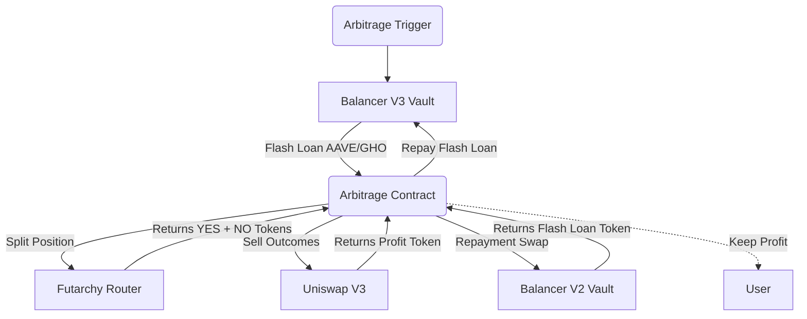

# Design: Mainnet Flash Arbitrage V1 (AAVE / GHO)

> **Objective:** Permissionless Flash Arbitrage for Futarchy Markets on Ethereum Mainnet.
> **Target Pair:** AAVE ↔ GHO

## 1. Architecture Overview

This system integrates three major protocols to perform risk-free arbitrage on Futarchy markets.

---

## 2. Core Components

### A. Flash Loan (Balancer V3)
*   **Source:** Balancer V3 Vault (`0xbA13...`)
*   **Mechanism:** `unlock()` pattern with callback.
*   **Why V3?** Highly gas-efficient flash loans and transient accounting.

### B. The Trade (Futarchy + Uniswap V3)
*   **Action:** Split collateral into YES/NO tokens.
*   **Market Structure:**
    *   Outcomes trade against each other (`YES_AAVE` / `YES_GHO`) or against collateral (`YES_AAVE` / `GHO`).
*   **Execution:** `Uniswap Universal Router` via `Permit2`.
*   **Verified Pools (Fee 500 / 0.05%):**
    *   `YES_AAVE` / `YES_GHO`: `0xd4776Ea355326C3D9Ab3Ff9417F12D6c8718066F`
    *   `NO_AAVE` / `NO_GHO`:  `0x08D364Bf5ED8698790114a56678d14b5d6a89A77`
    *   `YES_GHO` / `GHO`:     `0xbFf8e6A386d715284A394297121B863b71451A39`

### C. Repayment (Balancer V2)
*   **Challenge:** If we borrow AAVE but earn GHO (or vice versa), we must swap back to repay the loan.
*   **Solution:** Multi-hop `batchSwap` on Balancer V2.
*   **Why Batched?** Direct AAVE/GHO liquidity is low/non-existent. We use verified deep liquidity paths.

---

## 3. Repayment Strategy (GHO ↔ AAVE)

We use a verified **3-Hop Path** to swap GHO to AAVE (or reverse) efficiently.

> **Ref:** `docs/BALANCER_V2_ULTIMATE_GUIDE.md` for full breakdown and pool IDs.

**Path:** `GHO` → `GYD` → `wstETH` → `AAVE`

| Step | Token In | Token Out | Pool ID (Mainnet) |
| :--- | :--- | :--- | :--- |
| **1** | **GHO** | **GYD** | `0xaa7a70070e7495fe86c67225329dbd39baa2f63b000200000000000000000663` |
| **2** | **GYD** | **wstETH** | `0xc8cf54b0b70899ea846b70361e62f3f5b22b1f4b0002000000000000000006c7` |
| **3** | **wstETH** | **AAVE** | `0x3de27efa2f1aa663ae5d458857e731c129069f29000200000000000000000588` |

**Verification:**
*   All pools verified on-chain.
*   `estimate-gas` benchmarks show this path costs ~180k gas.

---

## 4. Optimization: Smart Approvals

To minimize gas costs, the contract implements a **Smart Approval System**:

1.  **Check-First Pattern:**
    *   Instead of `approve(Max)` every time (20k gas), we verify `allowance >= amount`.
    *   If allowance is sufficient, cost is 2.1k (warm read) vs 20k (write).

2.  **Permit2 Integration (Uniswap):**
    *   Uniswap Swaps require a 2-step approval: `Token -> Permit2 -> Router`.
    *   Contract checks BOTH allowances before writing.
    *   **Result:** Repeated arbitrage runs are significantly cheaper.

---

## 5. Mainnet Addresses

| Component | Address |
| :--- | :--- |
| **AaveFlashArbitrageV1** | *(To Be Deployed)* |
| **Futarchy Router** | `0xAc9Bf8EbA6Bd31f8E8c76f8E8B2AAd0BD93f98Dc` |
| **Balancer V3 Vault** | `0xbA1333333333a1BA1108E8412f11850A5C319bA9` |
| **Balancer V2 Vault** | `0xBA12222222228d8Ba445958a75a0704d566BF2C8` |
| **Uniswap V3 Factory** | `0x1F98431c8aD98523631AE4a59f267346ea31F984` |
| **Uniswap Universal Router** | `0xE592427A0AEce92De3Edee1F18E0157C05861564` |
| **Permit2** | `0x000000000022D473030F116dDEE9F6B43aC78BA3` |
