# Uniswap V3 + Universal Router Example

> **Live, verified example of SPOT_SPLIT arbitrage using Universal Router + Permit2**
> Successfully tested on Ethereum Mainnet on 2026-01-28

---

## Overview

This document shows a complete, working example of executing the SPOT_SPLIT arbitrage strategy using:

- **Universal Router** (`0x66a9893cc07d91d95644aedd05d03f95e1dba8af`)
- **Permit2** (`0x000000000022D473030F116dDEE9F6B43aC78BA3`)
- **QuoterV2** for slippage protection (`0x61fFE014bA17989E743c5F6cB21bF9697530B21e`)

### Result: **+1.93% profit** on 100 VLR

---

## Transaction Flow

```mermaid
graph LR
    A[100 VLR] -->|Split| B[100 YES_VLR<br>100 NO_VLR]
    B -->|Swap YES| C[0.228 YES_USDS]
    B -->|Swap NO| D[0.201 NO_USDS]
    C -->|Merge MIN| E[0.201 USDS]
    D -->|Merge MIN| E
    E -->|Swap via USDC| F[101.93 VLR]
    F -->|Profit| G[+1.93 VLR ✅]
```



---

## The Script

**File:** [`scripts/test-manual-spotsplit.js`](file:///home/arthur/futarchy-arb/scripts/test-manual-spotsplit.js)

### Key Components

```javascript
// Contract Addresses
const PERMIT2 = '0x000000000022D473030F116dDEE9F6B43aC78BA3';
const UNIVERSAL_ROUTER = '0x66a9893cc07d91d95644aedd05d03f95e1dba8af';
const QUOTER_V2 = '0x61fFE014bA17989E743c5F6cB21bF9697530B21e';
const FUTARCHY_ROUTER = '0xAc9Bf8EbA6Bd31f8E8c76f8E8B2AAd0BD93f98Dc';

// Tokens
const VLR = '0x4e107a0000DB66f0E9Fd2039288Bf811dD1f9c74';
const YES_VLR = '0x354582ff9f500f05b506666b75B33dbc90A8708d';
const NO_VLR = '0x4B53aE333bB337c0C8123aD84CE2F541ed53746E';
const YES_USDS = '0xa51aFa14963FaE9696b6844D652196959Eb5b9F6';
const NO_USDS = '0x1a9c528Bc34a7267b1c51a8CD3fad9fC99136171';

// Slippage protection
const SLIPPAGE = 3n; // 3%
```

### Approval Flow (Critical!)

```javascript
// Step 1: Token → Permit2 (one-time MAX approval)
await token.approve(PERMIT2, ethers.MaxUint256);

// Step 2: Permit2 → Universal Router
const MAX_UINT160 = BigInt('0xffffffffffffffffffffffffffffffffffffffff');
const MAX_UINT48 = 281474976710655n;
await permit2.approve(tokenAddress, UNIVERSAL_ROUTER, MAX_UINT160, MAX_UINT48);

// Step 3: Execute swap (NO SWEEP command - send directly to recipient)
const swapParams = ethers.AbiCoder.defaultAbiCoder().encode(
    ['address', 'uint256', 'uint256', 'bytes', 'bool'],
    [wallet.address, amountIn, minOut, path, true]
);

await universalRouter.execute(
    ethers.hexlify(new Uint8Array([0x00])), // V3_SWAP_EXACT_IN
    [swapParams],
    deadline,
    { gasLimit: 400000 }
);
```

---

## Live Execution Log

```
════════════════════════════════════════════════════════════
🧪 MANUAL SPOT_SPLIT - 100 VLR + 3% SLIPPAGE
   Using Universal Router + Permit2
════════════════════════════════════════════════════════════
Wallet: 0x645A3D9208523bbFEE980f7269ac72C61Dd3b552

📊 BEFORE BALANCES:
   VLR: 5030.89500054030163777

📝 STEP 1: Approve FutarchyRouter for 100 VLR...
   ✅ Approved

📝 STEP 2: Split 100 VLR → YES_VLR + NO_VLR...
   ✅ Split complete
   NEW YES_VLR: 100.0
   NEW NO_VLR: 100.0

📝 STEP 3: Swap YES_VLR → YES_USDS...
   Quote: 0.228595177775299132 YES_USDS
   Min (3% slip): 0.221737322442040158
   ✅ Got YES_USDS: 0.228595177775299132

📝 STEP 4: Swap NO_VLR → NO_USDS...
   Quote: 0.201397594189563959 NO_USDS
   Min (3% slip): 0.19535566636387704
   ✅ Got NO_USDS: 0.201397594189563959

📝 STEP 5: Merge outcomes → USDS...
   Merge amount (MIN): 0.201397594189563959
   ✅ Got USDS: 0.201397594189563959

📝 STEP 6: Swap USDS → VLR (via USDC)...
   Quote: 101.928725262063753679 VLR
   Min (3% slip): 98.870863504201841068
   ✅ Got VLR: 101.928725262063753679

════════════════════════════════════════════════════════════
📊 FINAL RESULT:
   Started with: 5030.895 VLR
   Spent:        100 VLR (the "loan")
   Got back:     101.929 VLR
   Net change:   +1.929 VLR
   ✅ PROFIT! 1.93%
```

---

## Slippage Protection

All swaps include 3% slippage protection using QuoterV2:

```javascript
// Get quote immediately before swap
const quote = await quoter.quoteExactInputSingle.staticCall({
    tokenIn, tokenOut, amountIn, fee: 500, sqrtPriceLimitX96: 0
});

// Set minimum 3% below quote
const minOut = (quote[0] * 97n) / 100n;
```

### Recommended Slippage by Token Type

| Token Type | Slippage |
|------------|----------|
| Stablecoins | 0.1-0.3% |
| Major (ETH/USDC) | 0.3-0.5% |
| Standard | 0.5-1% |
| **Conditional (YES/NO)** | **3-5%** |

---

## Common Mistakes

### ❌ Wrong: Using SWEEP command

```javascript
// This FAILS - SWEEP checks router's balance which is always 0
const commands = ethers.hexlify(new Uint8Array([V3_SWAP_EXACT_IN, SWEEP]));
```

### ✅ Correct: Send directly to recipient

```javascript
// Send output directly to wallet
const swapParams = encode(['address', ...], [wallet.address, ...]);  // recipient = wallet
const commands = ethers.hexlify(new Uint8Array([V3_SWAP_EXACT_IN]));  // NO SWEEP
```

### ❌ Wrong: Not approving to Permit2

```javascript
// This FAILS - "InsufficientToken" error
await token.approve(UNIVERSAL_ROUTER, amount);  // Wrong!
```

### ✅ Correct: Two-step approval

```javascript
// Step 1: Token → Permit2
await token.approve(PERMIT2, ethers.MaxUint256);

// Step 2: Permit2 → Router
await permit2.approve(token, UNIVERSAL_ROUTER, MAX_UINT160, MAX_UINT48);
```

---

## Run It Yourself

```bash
# 1. Check if opportunity exists (simulation only)
node -e "
const { ethers } = require('ethers');
const provider = new ethers.JsonRpcProvider('https://eth.llamarpc.com');
// ... quote simulation code
"

# 2. Execute manual arbitrage (uses real funds!)
node scripts/test-manual-spotsplit.js
```

---

## References

- [Universal Router Guide](file:///home/arthur/futarchy-arb/docs/UNISWAP_V3_ULTIMATE_GUIDE.md#universal-router--permit2-modern-approach)
- [MEV Protection](file:///home/arthur/futarchy-arb/docs/UNISWAP_V3_ULTIMATE_GUIDE.md#mev-protection--slippage)
- [Permit2 Docs](https://docs.uniswap.org/contracts/permit2/overview)
