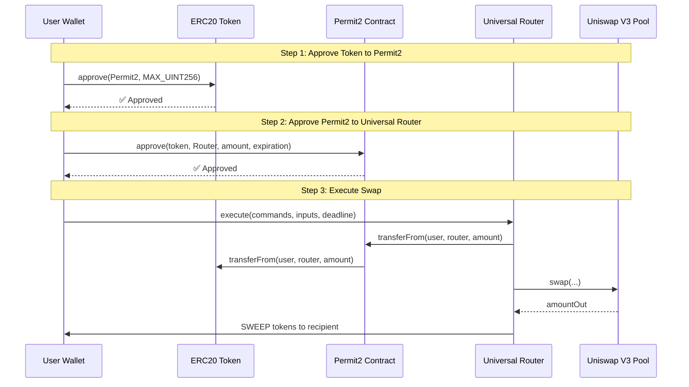
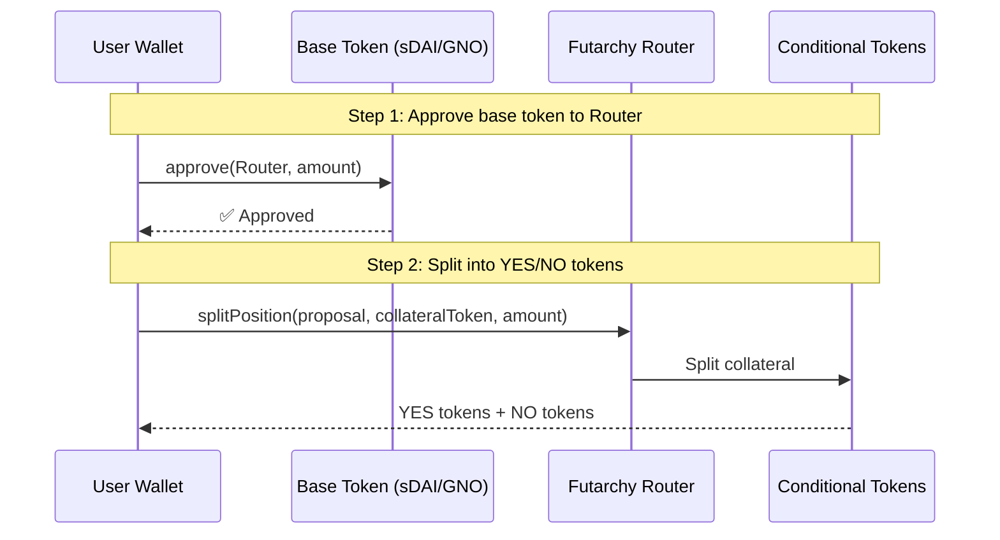

# Uniswap Swap Flow Documentation

> Comprehensive guide for executing swaps on Uniswap Universal Router using the Permit2 approval system on Ethereum Mainnet (Chain ID: 1).

## Overview

This document covers the complete swap flow used in the Futarchy.fi application for Uniswap V3 swaps on Ethereum Mainnet. The implementation uses:

- **Uniswap Universal Router** for executing swaps
- **Permit2** for gasless/batched approvals
- **Two-step approval flow**: ERC20 → Permit2 → Universal Router

---

## Architecture Diagram



---

## Contract Addresses (Chain ID: 1 - Ethereum Mainnet)

| Contract | Address | Description |
|----------|---------|-------------|
| **Universal Router** | `0x66a9893cc07d91d95644aedd05d03f95e1dba8af` | Main swap execution contract |
| **Permit2** | `0x000000000022D473030F116dDEE9F6B43aC78BA3` | Universal approval manager (same on all chains) |
| **QuoterV2** | `0x61fFE014bA17989E743c5F6cB21bF9697530B21e` | Get swap quotes |
| **V3 Factory** | `0x1F98431c8aD98523631AE4a59f267346ea31F984` | Pool factory |

### Multi-Chain Router Addresses

```javascript
const UNIVERSAL_ROUTER_ADDRESSES = {
  1: '0x66a9893cc07d91d95644aedd05d03f95e1dba8af',      // Ethereum Mainnet
  137: '0x1095692a6237d83c6a72f3f5efedb9a670c49223',    // Polygon
  10: '0xb555edF5dcF85f42cEeF1f3630a52A108E55A654',     // Optimism
  42161: '0x4C60051384bd2d3C01bfc845Cf5F4b44bcbE9de5', // Arbitrum
  100: '0x1095692a6237d83c6a72f3f5efedb9a670c49223',    // Gnosis
};
```

---

## Futarchy Router (Collateralization)

Before swapping conditional tokens, users must first **split** their base collateral into YES/NO tokens. This is done via the Futarchy Router.

### Futarchy Router Addresses by Chain

| Chain | Chain ID | Address |
|-------|----------|---------|
| **Ethereum Mainnet** | 1 | `0xAc9Bf8EbA6Bd31f8E8c76f8E8B2AAd0BD93f98Dc` |
| **Gnosis Chain** | 100 | `0x7495a583ba85875d59407781b4958ED6e0E1228f` |
| **Polygon** | 137 | `0x11a1EA07a47519d9900242e1b30a529ECD65588a` |

```javascript
// From runtime-chains.config.json
const FUTARCHY_ROUTER_ADDRESSES = {
  1: '0xAc9Bf8EbA6Bd31f8E8c76f8E8B2AAd0BD93f98Dc',    // Ethereum Mainnet
  100: '0x7495a583ba85875d59407781b4958ED6e0E1228f',   // Gnosis Chain
  137: '0x11a1EA07a47519d9900242e1b30a529ECD65588a',   // Polygon
};
```

### Futarchy Router ABI

```javascript
const FUTARCHY_ROUTER_ABI = [
  // Split base collateral into YES + NO conditional tokens
  "function splitPosition(address proposal, address collateralToken, uint256 amount) external",
  
  // Merge YES + NO tokens back into base collateral
  "function mergePositions(address proposal, address collateralToken, uint256 amount) external",
  
  // Redeem positions after proposal is resolved
  "function redeemProposal(address proposal, uint256 amount1, uint256 amount2) external"
];
```

### Collateralization Flow (Step 1 in ConfirmSwapModal)



### Example: Splitting sDAI into YES_sDAI + NO_sDAI

```javascript
import { ethers } from "ethers";

const FUTARCHY_ROUTER_ADDRESS = '0x7495a583ba85875d59407781b4958ED6e0E1228f';
const FUTARCHY_ROUTER_ABI = [
  "function splitPosition(address proposal, address collateralToken, uint256 amount) external"
];

async function splitCollateral(signer, proposalAddress, collateralTokenAddress, amount) {
  // 1. Approve collateral token to Futarchy Router
  const tokenContract = new ethers.Contract(
    collateralTokenAddress,
    ["function approve(address, uint256) returns (bool)"],
    signer
  );
  
  const approveTx = await tokenContract.approve(FUTARCHY_ROUTER_ADDRESS, amount);
  await approveTx.wait();
  console.log("Approved collateral to Futarchy Router");
  
  // 2. Split position
  const router = new ethers.Contract(FUTARCHY_ROUTER_ADDRESS, FUTARCHY_ROUTER_ABI, signer);
  const splitTx = await router.splitPosition(proposalAddress, collateralTokenAddress, amount);
  await splitTx.wait();
  console.log("Split complete! Received YES + NO tokens");
  
  return splitTx;
```

---

## Core Files

| File | Purpose |
|------|---------|
| [uniswapSdk.js](file:///c:/Users/arthd/Documents/GitHub/futarchy-web/src/utils/uniswapSdk.js) | Main SDK utilities for Uniswap swaps with Permit2 |
| [UniswapRouterCartridge.js](file:///c:/Users/arthd/Documents/GitHub/futarchy-web/futarchy-sdk/executors/UniswapRouterCartridge.js) | SDK Cartridge for Universal Router operations |
| [ConfirmSwapModal.jsx](file:///c:/Users/arthd/Documents/GitHub/futarchy-web/src/components/futarchyFi/marketPage/ConfirmSwapModal.jsx) | UI component that orchestrates the swap flow |

---

## ABIs

### ERC20 ABI

```javascript
const ERC20_ABI = [
  "function approve(address spender, uint256 amount) returns (bool)",
  "function allowance(address owner, address spender) view returns (uint256)",
  "function balanceOf(address account) view returns (uint256)",
  "function decimals() view returns (uint8)",
  "function symbol() view returns (string)"
];
```

### Permit2 ABI

```javascript
const PERMIT2_ABI = [
  // Check current allowance
  "function allowance(address owner, address token, address spender) view returns (uint160 amount, uint48 expiration, uint48 nonce)",
  // Approve spender to use tokens via Permit2
  "function approve(address token, address spender, uint160 amount, uint48 expiration)"
];
```

### Universal Router ABI

```javascript
const UNIVERSAL_ROUTER_ABI = [
  "function execute(bytes commands, bytes[] inputs, uint256 deadline) payable"
];
```

### QuoterV2 ABI

```javascript
const QUOTER_V2_ABI = [
  "function quoteExactInputSingle(tuple(address tokenIn, address tokenOut, uint256 amountIn, uint24 fee, uint160 sqrtPriceLimitX96) params) external returns (uint256 amountOut, uint160 sqrtPriceX96After, uint32 initializedTicksCrossed, uint256 gasEstimate)",
  "function quoteExactInput(bytes path, uint256 amountIn) external returns (uint256 amountOut, uint160[] sqrtPriceX96AfterList, uint32[] initializedTicksCrossedList, uint256 gasEstimate)"
];
```

---

## Constants & Max Values

```javascript
// Maximum values for approvals
const MAX_UINT256 = ethers.constants.MaxUint256;  // 2^256 - 1
const MAX_UINT160 = ethers.BigNumber.from("0xffffffffffffffffffffffffffffffffffffffff"); // 2^160 - 1
const MAX_UINT48 = ethers.BigNumber.from("0xffffffffffff"); // 2^48 - 1
const PERMIT2_MAX_EXPIRATION = MAX_UINT48.toNumber(); // Max expiration for Permit2

// Universal Router Commands
const Commands = {
  V3_SWAP_EXACT_IN: 0x00,
  V3_SWAP_EXACT_OUT: 0x01,
  PERMIT2_PERMIT: 0x0a,
  WRAP_ETH: 0x0b,
  UNWRAP_WETH: 0x0c,
  PERMIT2_TRANSFER_FROM_BATCH: 0x0d,
  V4_SWAP: 0x10,
  SWEEP: 0x04,
  PAY_PORTION: 0x06,
};

// Special recipient address (MSG_SENDER in Universal Router)
const RECIPIENT_MSG_SENDER = '0x0000000000000000000000000000000000000002';
```

---

## Complete Swap Flow - Step by Step

### Step 1: Check ERC20 Approval to Permit2

First, check if the token has been approved to the Permit2 contract.

```javascript
import { ethers } from "ethers";

const PERMIT2_ADDRESS = '0x000000000022D473030F116dDEE9F6B43aC78BA3';

async function checkERC20Approval(tokenAddress, ownerAddress, provider) {
  const tokenContract = new ethers.Contract(tokenAddress, ERC20_ABI, provider);
  const allowance = await tokenContract.allowance(ownerAddress, PERMIT2_ADDRESS);
  return allowance; // BigNumber
}
```

### Step 2: Approve Token to Permit2 (if needed)

If allowance is insufficient, approve MAX_UINT256 to Permit2:

```javascript
async function approveTokenToPermit2(tokenAddress, signer, amount = MAX_UINT256) {
  const tokenContract = new ethers.Contract(tokenAddress, ERC20_ABI, signer);
  
  const tx = await tokenContract.approve(PERMIT2_ADDRESS, amount, {
    gasLimit: 100000
  });
  
  await tx.wait();
  return tx;
}
```

### Step 3: Check Permit2 Approval to Universal Router

Check if Permit2 has been approved to spend tokens on behalf of the Universal Router:

```javascript
async function checkPermit2Approval(tokenAddress, ownerAddress, provider, chainId = 1) {
  const routerAddress = UNIVERSAL_ROUTER_ADDRESSES[chainId];
  const permit2Contract = new ethers.Contract(PERMIT2_ADDRESS, PERMIT2_ABI, provider);
  
  const [amount, expiration, nonce] = await permit2Contract.allowance(
    ownerAddress,
    tokenAddress,
    routerAddress
  );
  
  const now = Math.floor(Date.now() / 1000);
  const isApproved = amount.gt(0) && expiration > now;
  
  return { amount, expiration, nonce, isApproved };
}
```

### Step 4: Approve Permit2 to Universal Router (if needed)

If Permit2 approval is expired or insufficient:

```javascript
async function approvePermit2ToRouter(tokenAddress, signer, chainId = 1) {
  const routerAddress = UNIVERSAL_ROUTER_ADDRESSES[chainId];
  const permit2Contract = new ethers.Contract(PERMIT2_ADDRESS, PERMIT2_ABI, signer);
  
  // Use MAX values for amount and expiration
  const amount = MAX_UINT160;
  const expiration = PERMIT2_MAX_EXPIRATION;
  
  const tx = await permit2Contract.approve(
    tokenAddress,
    routerAddress,
    amount,
    expiration,
    { gasLimit: 100000 }
  );
  
  await tx.wait();
  return tx;
}
```

### Step 5: Execute the Swap

Execute the swap through the Universal Router:

```javascript
async function executeUniswapV3Swap({
  tokenIn,
  tokenOut,
  amountIn,
  minAmountOut = "0",
  fee = 500, // 0.05% for conditional tokens
  recipient,
  signer
}) {
  const chainId = await signer.getChainId();
  const routerAddress = UNIVERSAL_ROUTER_ADDRESSES[chainId];
  
  // Get token decimals
  const tokenInContract = new ethers.Contract(tokenIn, ERC20_ABI, signer.provider);
  const tokenOutContract = new ethers.Contract(tokenOut, ERC20_ABI, signer.provider);
  const [decimalsIn, decimalsOut] = await Promise.all([
    tokenInContract.decimals(),
    tokenOutContract.decimals()
  ]);
  
  // Parse amounts
  const amountInWei = ethers.utils.parseUnits(amountIn.toString(), decimalsIn);
  const minAmountOutWei = ethers.utils.parseUnits(minAmountOut.toString(), decimalsOut);
  
  // Build the path: tokenIn + fee (3 bytes) + tokenOut
  const path = ethers.utils.solidityPack(
    ['address', 'uint24', 'address'],
    [tokenIn, fee, tokenOut]
  );
  
  // Encode V3_SWAP_EXACT_IN parameters
  const v3SwapParams = ethers.utils.defaultAbiCoder.encode(
    ['address', 'uint256', 'uint256', 'bytes', 'bool'],
    [
      recipient || RECIPIENT_MSG_SENDER,
      amountInWei,
      minAmountOutWei,
      path,
      true // payerIsUser
    ]
  );
  
  // Encode SWEEP parameters (send output tokens to recipient)
  const ownerAddress = await signer.getAddress();
  const sweepParams = ethers.utils.defaultAbiCoder.encode(
    ['address', 'address', 'uint256'],
    [tokenOut, recipient || ownerAddress, minAmountOutWei]
  );
  
  // Build commands
  const commands = ethers.utils.hexlify([Commands.V3_SWAP_EXACT_IN, Commands.SWEEP]);
  const inputs = [v3SwapParams, sweepParams];
  const deadline = ethers.BigNumber.from(Math.floor(Date.now() / 1000) + 1200); // 20 minutes
  
  // Execute
  const routerContract = new ethers.Contract(routerAddress, UNIVERSAL_ROUTER_ABI, signer);
  
  const tx = await routerContract.execute(commands, inputs, deadline, {
    value: 0,
    gasLimit: 350000
  });
  
  return tx;
}
```

---

## Getting a Quote

Before executing a swap, get a quote to determine expected output and set slippage:

```javascript
async function getUniswapV3QuoteWithPriceImpact({
  tokenIn,
  tokenOut,
  amountIn,
  fee = 500,
  provider,
  chainId = 1
}) {
  const quoterAddress = '0x61fFE014bA17989E743c5F6cB21bF9697530B21e';
  const quoterContract = new ethers.Contract(quoterAddress, QUOTER_V2_ABI, provider);
  
  // Get token decimals
  const tokenInContract = new ethers.Contract(tokenIn, ERC20_ABI, provider);
  const decimalsIn = await tokenInContract.decimals();
  
  // Parse amount
  const amountInWei = ethers.utils.parseUnits(amountIn.toString(), decimalsIn);
  
  // Build quote params
  const params = {
    tokenIn,
    tokenOut,
    amountIn: amountInWei,
    fee,
    sqrtPriceLimitX96: 0 // No price limit
  };
  
  // Use callStatic for off-chain simulation
  const result = await quoterContract.callStatic.quoteExactInputSingle(params);
  
  // result = [amountOut, sqrtPriceX96After, initializedTicksCrossed, gasEstimate]
  return {
    amountOut: result[0].toString(),
    sqrtPriceX96After: result[1].toString(),
    initializedTicksCrossed: result[2].toString(),
    gasEstimate: result[3].toString()
  };
}
```

---

## Slippage Configuration

Slippage tolerance is applied to the minimum output amount:

```javascript
function calculateMinOutputWithSlippage(expectedOutput, slippagePercent) {
  // slippagePercent is e.g., 0.5 for 0.5%, 3 for 3%
  const slippageFactor = 1 - (slippagePercent / 100);
  const minOutput = parseFloat(expectedOutput) * slippageFactor;
  return minOutput.toString();
}

// Example: 3% slippage
const expectedOutput = "100"; // 100 tokens
const slippage = 3; // 3%
const minOutput = calculateMinOutputWithSlippage(expectedOutput, slippage);
// minOutput = "97" (100 * 0.97)
```

### Slippage Recommendations

| Pool Type | Recommended Slippage |
|-----------|---------------------|
| Major pairs (ETH/USDC) | 0.1% - 0.5% |
| Standard pairs | 0.5% - 1% |
| Low liquidity pools | 1% - 3% |
| Conditional tokens (Futarchy) | 3% - 5% |

---

## Complete Flow Function

The `completeSwapFlow` function handles the entire process:

```javascript
async function completeSwapFlow({
  tokenIn,
  tokenOut,
  amountIn,
  minAmountOut,
  fee = 500,
  recipient,
  signer,
  onProgress
}) {
  const chainId = await signer.getChainId();
  const ownerAddress = await signer.getAddress();
  
  try {
    // Step 1: Check ERC20 approval to Permit2
    onProgress?.({ step: 'checking', message: 'Checking approvals...' });
    
    const erc20Allowance = await checkERC20Approval(tokenIn, ownerAddress, signer.provider);
    const amountInWei = ethers.utils.parseUnits(amountIn.toString(), 18);
    
    if (erc20Allowance.lt(amountInWei)) {
      onProgress?.({ step: 'erc20_approve', message: 'Approving token to Permit2...' });
      const approveTx = await approveTokenToPermit2(tokenIn, signer);
      await approveTx.wait();
      onProgress?.({ step: 'erc20_approved', message: 'Token approved to Permit2!' });
    }
    
    // Step 2: Check Permit2 approval to Universal Router
    const permit2Status = await checkPermit2Approval(tokenIn, ownerAddress, signer.provider, chainId);
    
    if (!permit2Status.isApproved) {
      onProgress?.({ step: 'permit2_approve', message: 'Approving Permit2 to Universal Router...' });
      const permit2Tx = await approvePermit2ToRouter(tokenIn, signer);
      await permit2Tx.wait();
      onProgress?.({ step: 'permit2_approved', message: 'Permit2 approved to Router!' });
    }
    
    // Step 3: Execute the swap
    onProgress?.({ step: 'swapping', message: 'Executing swap...' });
    
    const swapTx = await executeUniswapV3Swap({
      tokenIn,
      tokenOut,
      amountIn,
      minAmountOut,
      fee,
      recipient,
      signer
    });
    
    const receipt = await swapTx.wait();
    
    onProgress?.({ step: 'complete', message: 'Swap completed!', receipt });
    
    return receipt;
    
  } catch (error) {
    onProgress?.({ step: 'error', message: `Error: ${error.message}`, error });
    throw error;
  }
}
```

---

## Using the SDK Cartridge

For SDK-based integration, use `UniswapRouterCartridge`:

```javascript
import { UniswapRouterCartridge } from 'futarchy-sdk/executors/UniswapRouterCartridge';

// Initialize cartridge
const cartridge = new UniswapRouterCartridge({
  chainId: 1, // Ethereum Mainnet
  routerAddress: '0x66a9893cc07d91d95644aedd05d03f95e1dba8af',
  permit2Address: '0x000000000022D473030F116dDEE9F6B43aC78BA3'
});

// Execute complete swap flow
const generator = cartridge.completeSwap({
  tokenIn: '0x...', // Input token address
  tokenOut: '0x...', // Output token address
  amountIn: '1.5', // Amount as string
  minAmountOut: '1.45', // Minimum output with slippage
  recipient: account,
  fee: 500, // 0.05%
  exactApproval: false // Use max approval
}, { publicClient, walletClient, account });

// Process steps
for await (const step of generator) {
  console.log('Step:', step);
  
  if (step.status === 'error') {
    console.error('Error:', step.message);
    break;
  }
  
  if (step.step === 'complete') {
    console.log('Swap successful! TX:', step.data.transactionHash);
  }
}
```

---

## Gas Configuration

Gas limits and fee configuration from `runtime-chains.config.json`:

```javascript
const GAS_CONFIG = {
  1: { // Ethereum Mainnet
    minPriorityFeeGwei: "0.04",
    maxFeeGwei: "150",
    gasLimits: {
      split: 1000000,
      merge: 1500000,
      swap: 350000,
      approve: 100000
    }
  },
  137: { // Polygon
    minPriorityFeeGwei: "30",
    maxFeeGwei: "500",
    gasLimits: {
      split: 1500000,
      merge: 1500000,
      swap: 500000,
      approve: 100000
    }
  }
};
```

---

## Error Handling

### Common Errors

| Error | Cause | Solution |
|-------|-------|----------|
| `execution reverted: STF` | Slippage too low | Increase slippage tolerance |
| `execution reverted: TF` | Transfer failed | Check token balance/approval |
| `No pool found` | Pool doesn't exist | Try different fee tier (500, 3000, 10000) |
| `UNPREDICTABLE_GAS_LIMIT` | Transaction will fail | Check approvals and balances |

### Slippage Error Detection

```javascript
function isSlippageError(error) {
  const slippageKeywords = [
    "too little received",
    "insufficient output amount",
    "slippage",
    "amountOutMinimum",
    "price impact"
  ];
  
  const message = error.message?.toLowerCase() || '';
  return slippageKeywords.some(keyword => message.includes(keyword));
}
```

---

## Safe Wallet Support

For Safe (Gnosis Safe) wallets, transactions are handled differently:

```javascript
import { isSafeWallet } from './ethersAdapters';
import { waitForSafeTxReceipt } from './waitForSafeTxReceipt';

// Check if using Safe wallet
if (isSafeWallet(walletClient)) {
  console.log('Safe wallet detected');
  
  // For Safe, we don't wait for immediate receipt
  // Instead, we wait for the Safe transaction to be executed
  const chainId = await publicClient.getChainId();
  const receipt = await waitForSafeTxReceipt({
    chainId,
    safeTxHash: hash,
    publicClient
  });
}
```

---

## UI Integration (ConfirmSwapModal)

The swap modal shows 3 steps for Uniswap SDK flow:

```javascript
const stepsData = {
  1: {
    title: 'Adding Collateral',
    substeps: [
      { id: 1, text: 'Approving base token for Futarchy Router' },
      { id: 2, text: 'Split wrapping position' }
    ]
  },
  2: {
    title: 'Processing Swap',
    substeps: [
      { id: 1, text: 'Step 1: Approve token to Permit2' },
      { id: 2, text: 'Step 2: Approve Permit2 to Universal Router' },
      { id: 3, text: 'Executing swap' }
    ]
  }
};
```

---

## Fee Tiers

Uniswap V3 supports multiple fee tiers:

| Fee Tier | Value | Use Case |
|----------|-------|----------|
| 0.01% | 100 | Stable pairs |
| 0.05% | 500 | **Conditional tokens (default)** |
| 0.3% | 3000 | Standard pairs |
| 1% | 10000 | Exotic pairs |

The SDK uses `fee = 500` (0.05%) by default for conditional token swaps.

---

## References

- [Uniswap Universal Router](https://docs.uniswap.org/contracts/v3/reference/periphery/UniversalRouter)
- [Permit2 Documentation](https://docs.uniswap.org/contracts/permit2/overview)
- [Uniswap V3 Concepts](https://docs.uniswap.org/concepts/protocol/concentrated-liquidity)

---

## Summary

The Uniswap swap flow consists of:

1. **ERC20 → Permit2**: One-time approval of MAX_UINT256
2. **Permit2 → Router**: Approve with amount and expiration
3. **Execute**: Call `execute()` on Universal Router with encoded commands

This two-step approval system (via Permit2) provides:
- Better security (expiring approvals)
- Gas efficiency (batch approvals)
- Revocable permissions
